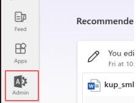
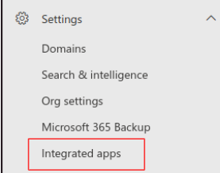
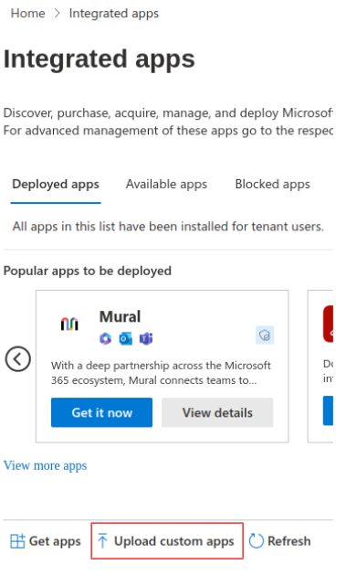
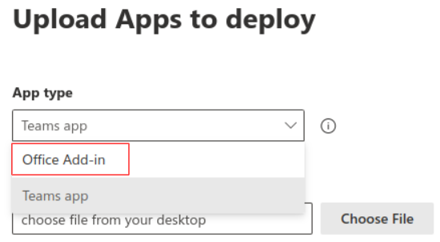
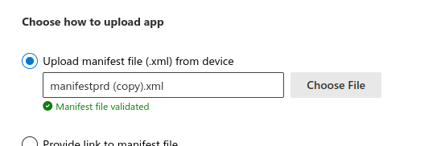
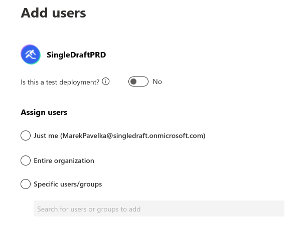
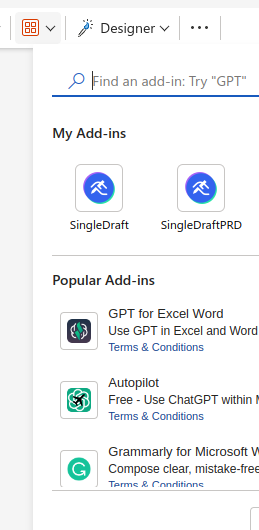
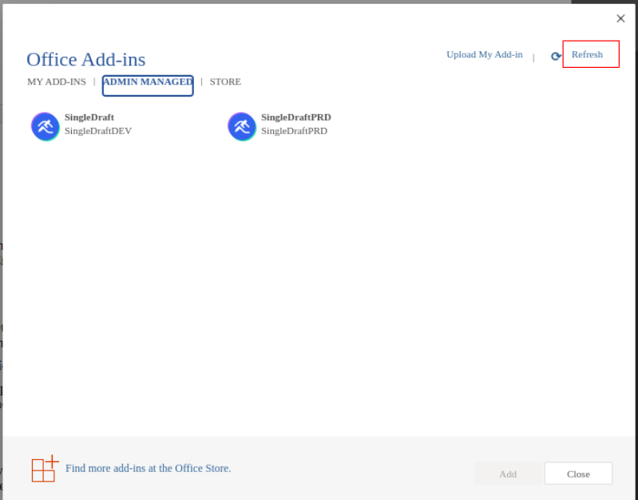

# Installation

## Prerequisites

- Download “manifest” file ([Click here to download the manifest file](https://drive.google.com/file/d/1JgzdldbRdjwvAh9Y9rVPL3QN9A8SzAuL/view?usp=drive_link))
- Have Microsoft Office 365 account
- Have one of these roles: 
    - Global Administrator
    - Azure Application Administrator
    - Exchange Administrator
- Management and deployment via Integrated Apps require that the users are using one of these:
    - Microsoft 365 Business licenses (Business Basic, Business Standard, Business Premium)
    - Office 365 Enterprise licenses (E1/E3/E5/F3)
    - Microsoft 365 Enterprise licenses (E3/E5/F3)

## Setup
- Go To Microsoft Office 365 and on the left sidebar click Admin icon. 

  
- Go to Settings > Integrated apps. 

  
- Click on Upload custom apps. 

  
- Select App type = Office Add-in 

  
- Choose Upload manifest file from device, use the file provided above 

  
- Click Next
- Add users:
    - Keep the toggle for test deployment to No
    - Assign which users should be able to see and use the Add-in 

  
- Click Next
- Accept permission request by clicking Next
- Click Finish deployment
- You should be able to see the Add-in in MS Word among My Add Ins: 

  
:::warning You don't see the plugin yet?
Try refreshing the dialog:
  
:::